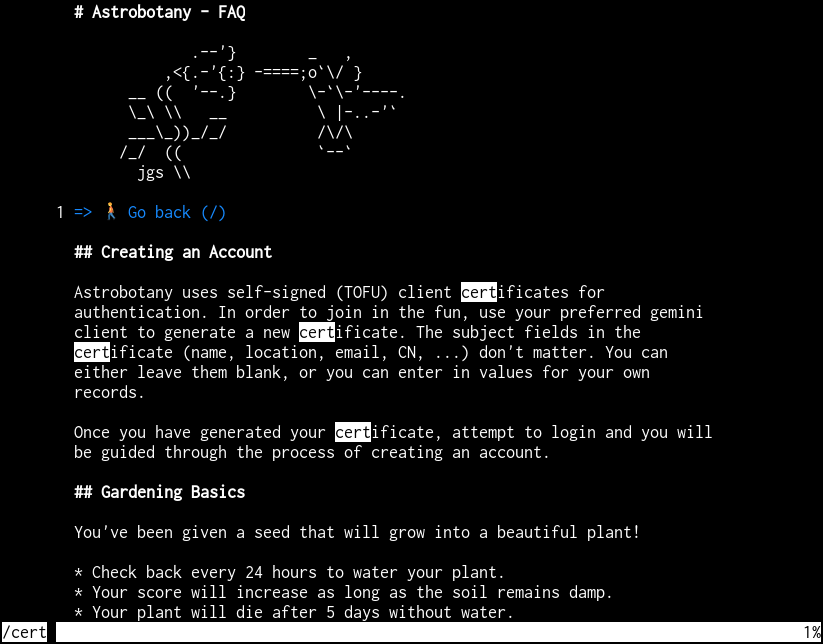

`gmir` is a reader for gmi files (of the Gemini protocol). Its goal is
to make reading gmi files more pleasant than with a pager like `less`,
while also offering link selection.

Features include word wrapping, syntax highlighting, jumping to headings
and more.

The link selection feature is intended to make `gmir`
well suited as the pager for Gemini browsers like
[acdw/bollux](https://tildegit.org/acdw/bollux),
[chambln/gmi](https://sr.ht/~chambln/gmi/) or
[blmayer/astro](https://github.com/blmayer/astro). Unlike with less,
following links is possible without dropping back to a command prompt
first. Once a link is selected, `gmir` quits and prints its URL to the
standard output.



# Installation
You can find precompiled binaries at the
[releases page](https://github.com/codesoap/gmir/releases). If you
prefer to install from source, execute this:

```
go install github.com/codesoap/gmir/cmd/gmir@latest
```

The `gmir` binary is now located at `~/go/bin/gmir`. If you use Go
version 1.15 or older, use `go get` instead.

# Usage
```
$ gmir -h
Usage:
gmir [-u] [FILE]
If FILE is not given, standard input is read.

Options:
-u  Hide URLs of links by default

Key bindings:
Up, k     : Scroll up one line
Down, j   : Scroll down one line
Right, l  : Scroll right one column; reset with Esc
u         : Scroll up half a page
d         : Scroll down half a page
Page up, b: Scroll up a full page
Page down,
f, Space  : Scroll down a full page
g         : Go to the top
G         : Go to the bottom
h         : Go to next heading
H         : Go to previous heading
/         : Start search
?         : Start reverse search
n         : Go to next search match
p         : Go to previous search match
0-9       : Enter link number
Esc       : Clear input and right scroll
v         : Hide link URLs
V         : Show link URLs
q         : Quit
```

# TODO
Here are some ideas on what could be added in the future, in no
particular order:
- Add key bindings for going back, forward and reloading a page.
- Enable passing a "title" that is displayed in the status line. This
  could be used to display the currently visited URL.
